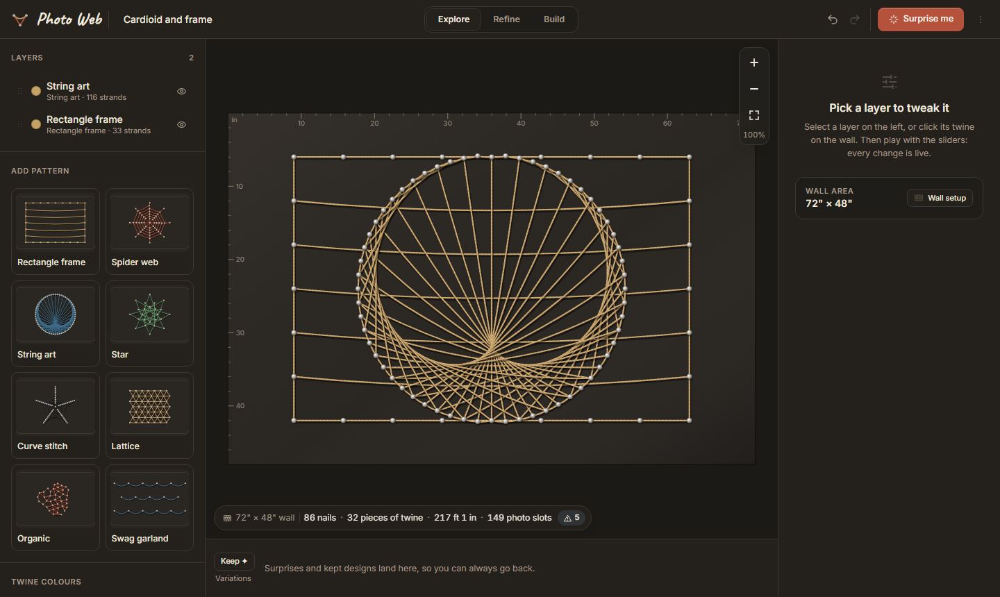
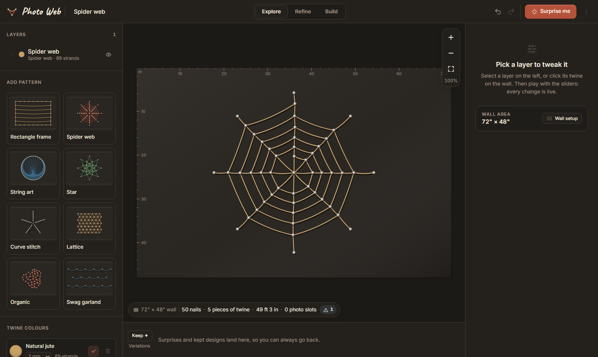
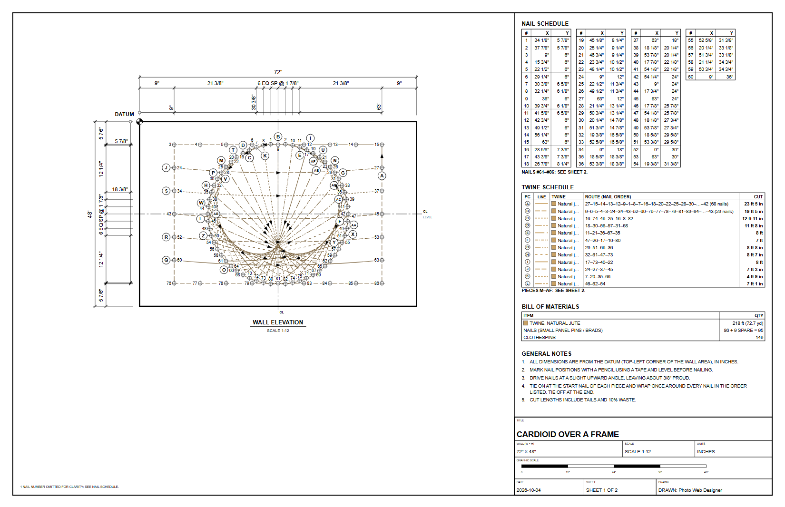

# Photo Web Designer

Design a **photo web**: nails on a wall, twine strung between them, photos clothes-pinned to the twine. Pick a string pattern, tweak it to fit your wall, then get a plan you can actually build from.

**Use it:** <http://photo-web.south.solutions>



## Why

The hard part of a photo web isn't hanging photos, it's the string pattern: where the nails go, how the twine runs, how much you need to buy. This lets you play with patterns on a to-scale wall first, so you only nail once.

## How to use it

1. **Set up your wall.** Enter its real size (inches or cm), or pick a common space. Optionally add a photo of the wall to see the web in place.
2. **Explore.** Add patterns from the left (spider web, string art, star, lattice, swag garland and more), stack them, and drag the sliders. Hit **Surprise me** for a random design, and **Keep** the ones you like.
3. **Refine.** Move nails, add or connect them by hand, and bake a pattern into editable nails. Snap nails to a grid (e.g. every half inch), and check the **Issues** overlay for nails too close together, overloaded, or strands too steep for photos.
4. **Build.** Get a dimensioned drawing (PDF or PNG), a cut and shopping list, a nail coordinate table, a 1:1 paper template to tape to the wall, and optional step-by-step stringing instructions.

Your design saves in your browser automatically. **Copy share link** in the menu sends it to someone else.



## The build plan

This is what you take to the wall: a scaled, dimensioned drawing with every nail numbered and located, each piece of twine and its cut length, a materials list and build notes. [Open the full PDF](docs/example-plan.pdf).

[](docs/example-plan.pdf)

It works on phones too, so you can open the build steps next to the wall.

## What you get

- Real sizes everywhere. A nail at 24" is at 24" on the wall.
- Fewest pieces of twine: each colour is routed as one continuous run wherever possible, with the cut length of each piece including wrap and tails.
- Photo slot estimates on any strand, at any angle, based on your photo size.

## Develop

```bash
npm install
npm run dev     # local dev server
npm run check   # typecheck, lint, tests
```

React, Vite and TypeScript. Domain boundaries and contribution rules are in [AGENTS.md](AGENTS.md). Pushes to `main` deploy to GitHub Pages.
